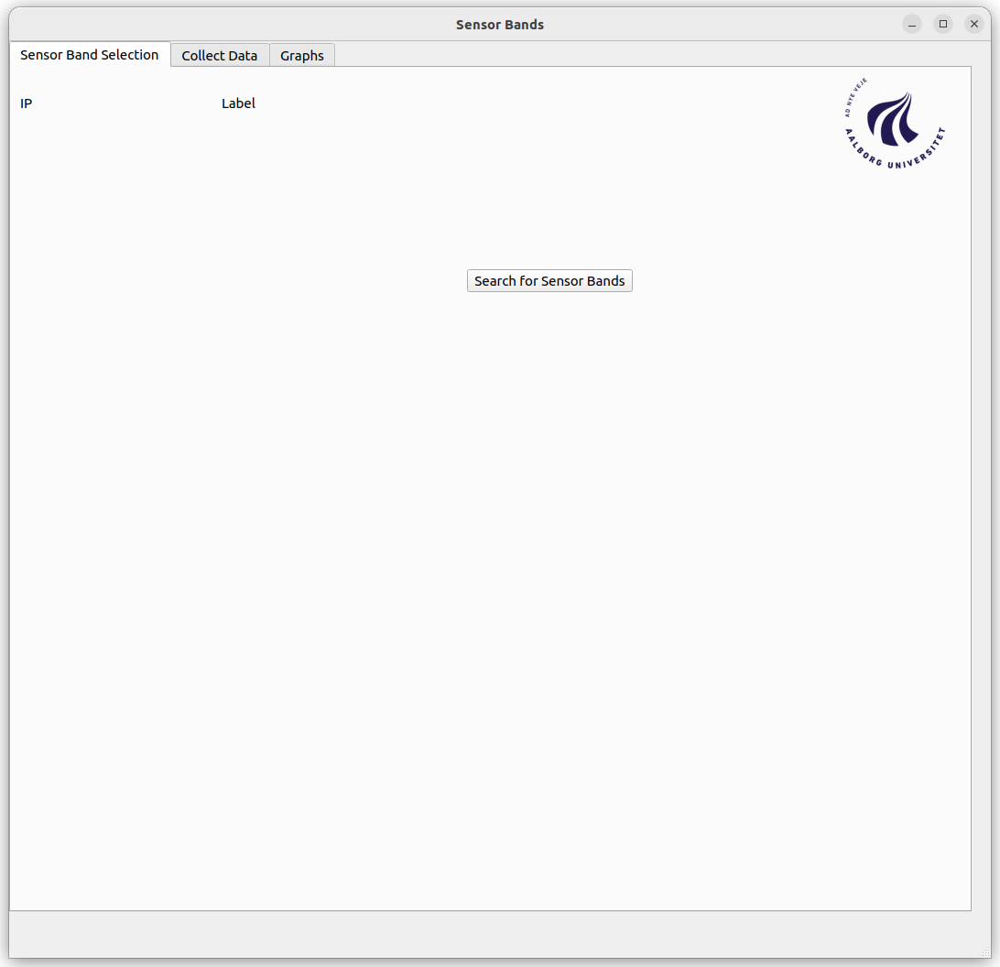
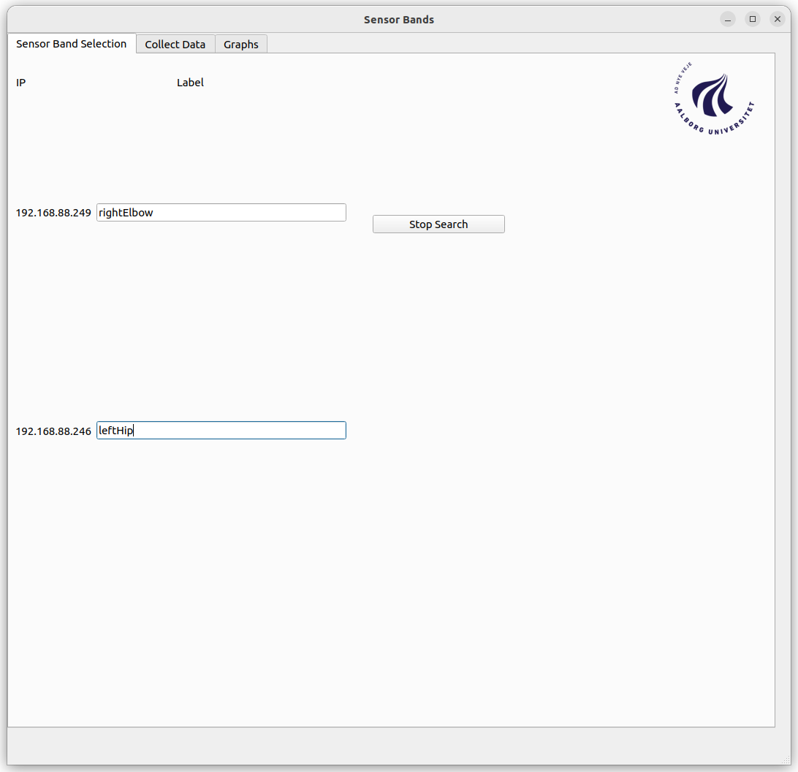
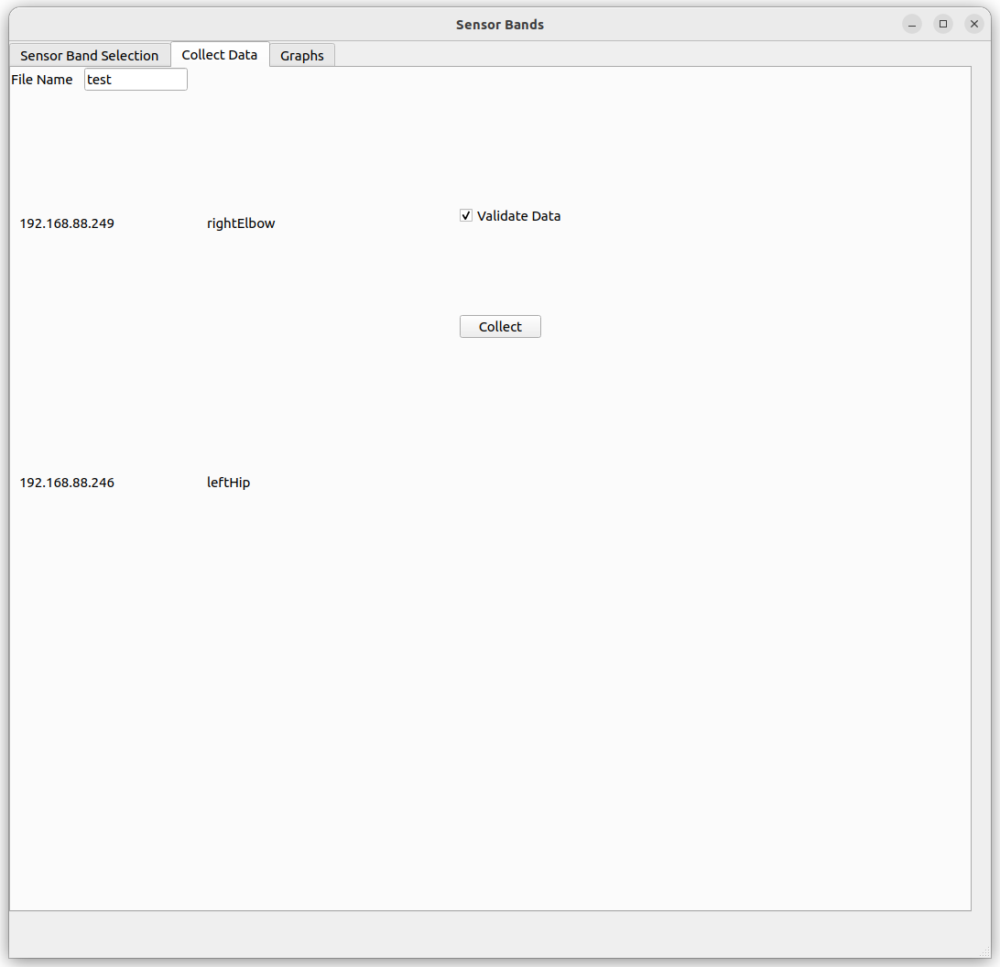
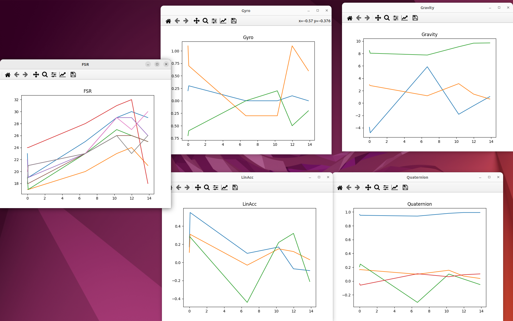
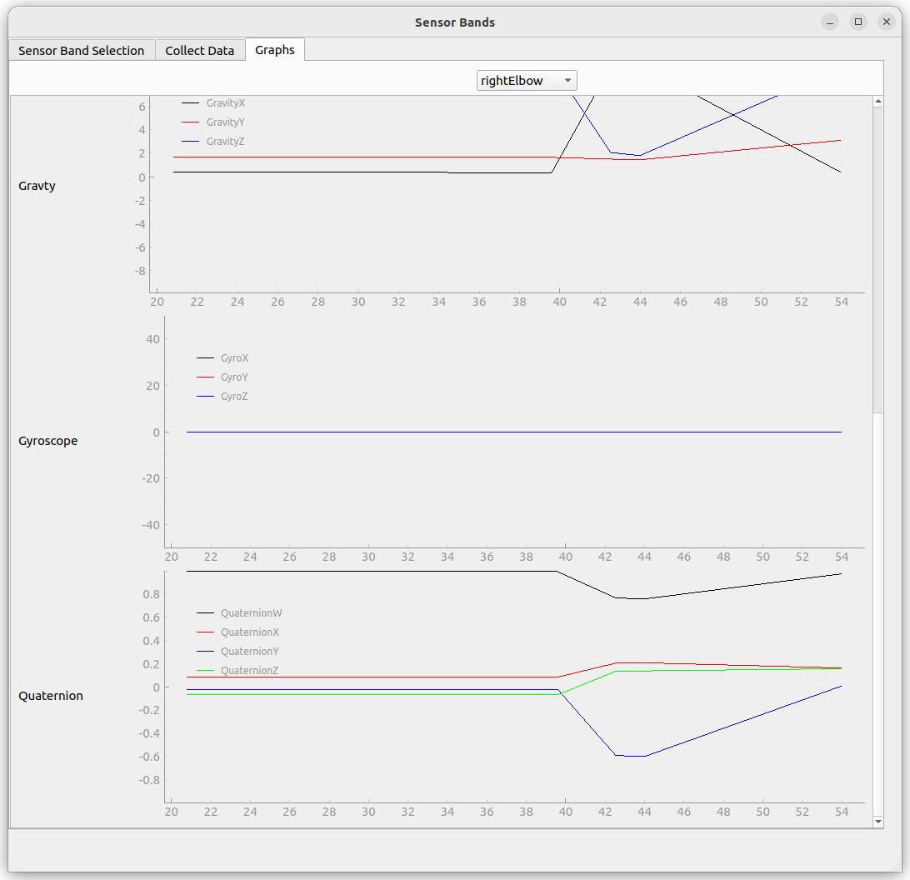

# SensorBandsGUI
## Requirements

* Have ROS2 Humble installed ([Install ROS2 Humble](Requerimentsrequirements))
* Have [PyQt5](https://pypi.org/project/PyQt5/)
* Have [Matplotlib](https://matplotlib.org/stable/users/getting_started/index.html#installation-quick-start)
* Have [git](https://git-scm.com/downloads) installed

## Instalation
Create a workspace in your computer ([Create a workspace](https://docs.ros.org/en/foxy/Tutorials/Beginner-Client-Libraries/Creating-A-Workspace/Creating-A-Workspace.html))

Clone the repository inside the *src* folder
```sh
git clone https://github.com/ipujol10/SensorBandsGUI.git [<dest_folder>]
```

## Compilation
In the root folder of the workspace, load it
```sh
source install/local_setup.bash
```

Compile the workspace
```sh
colcon build
```

## Run the GUI
Run the ROS executable
```sh
ros2 run [<package_name>] launch_gui
```

### The GUI
When the application is runed, it will appear this image.


Once the searching for bands is activated, it will look for new bands to add to the system

As the system discovers new Sensor Bands, they will appear in the screen with the IP and a tet box where you have to label the ones you are going to use

Once you have the bands located, you can collect data or see the data in real time
#### **Collect Data**

First of all it is worth noting that the taged bands are displayed on the left side and will be the ones to appear in the data file

The file name input is o specify how do you want to name the outpt file (in case that is left blank, *data* is going to be used) and then it will add a number to the end to be able to collect several files without overriding them.

For example if *File name* is **test** it will create test0.csv, test1.csv, test2.csv, etc.

If the *Validate Data* box is selected, the graphics of the collected data can be observed without having to open the file


#### **Graphics**
The real time data can be observed in the *Graphs* tab

On the top you have to select the sensor band that you want to see (from the ones tagged) and then it will display 5 graphics (FSR, Linnear Acceleration, Gyroscope, Gravity and Quaternion)
